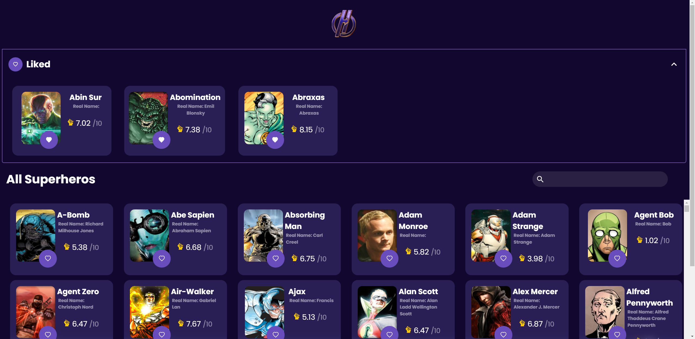

# Super Heros - Front-end
Single Web Application using TypeScritp and React JS  

# Run this proyect
Run [NPM Install]
 
then you will need to run [NPM start]

This application is a list of superheroes that allows to search and select favorites using the information
from https://akabab.github.io/superhero-api/api/all.json . It has two important
sections, the favorites list, and the general list.

• While the information is being fetched, a loading interface is being displayed with react-content-loader. 
• When the collapse button is clicked the favorite superheores is being hidden. 
• When a card of the favorites list is clicked, it is removed from there and be added
  back to the general list. This process is inverse for a card in the general list.  
• When a superhero is added as favorite, the app scrolls up to that recently added card.  
  Besides this, the card is marked to differentiate which is the last one. Is always
  added as the last element.  
• The favorites is restored when the application is reloaded, the favorites is only a list of the superhero identifiers [1,25,34].  
• The general list has a fixed height which is always less than the window height
  and render only what is being seen with react-window and Autosizer.  
• The search box can search by name and real name in the general list, also information is being display during each key event.  
• The application is full responsive.  

Results

